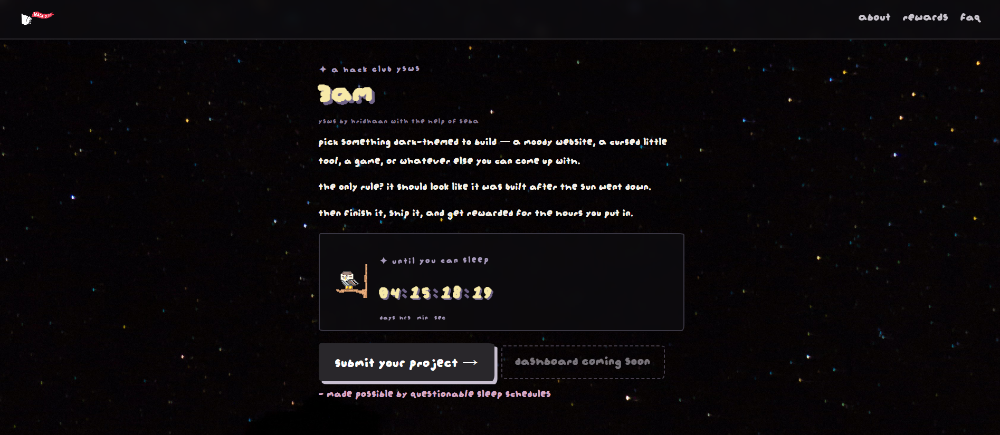
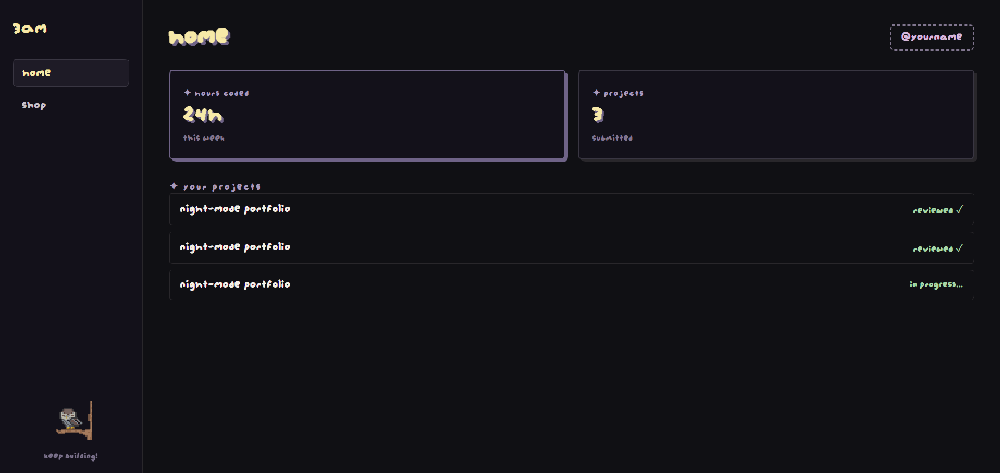
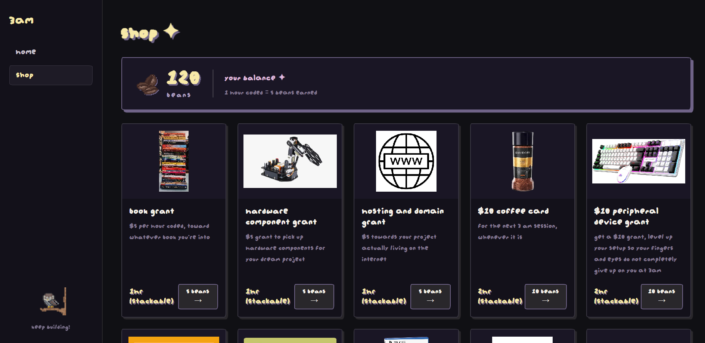

# 3AM

Demo: https://khanaaaaaa.github.io/3AM/

## What It Is

My redesign of the 3AM YSWS site :) Just a more fun version of the version 1.0 of the site.

## Why I Made It

Requested by @Hridhaan, and I just wanted to get my hands on a YSWS more than just reviewing. Also heavily inspired by jamegam.hackclub.com for the cute vibe I wanted in this YSWS website.

## Tech Stack

- HTML
- CSS
- JavaScript

## What I Learnt & What I Struggled With

Learnt on how to make pictures move using JavaScript (basically tick function), and found out I was pretty good at pixel art in the process. Was pretty cool researching and learning from other YSWS sites, and coming up with my own spin. Struggled a lot with the formating and where everything should be and as this was my first time doing a lot of stuff, had to redo a ton of things T-T And also make stuff according to feedback. Pretty fun regardless though!

## Screenshots

